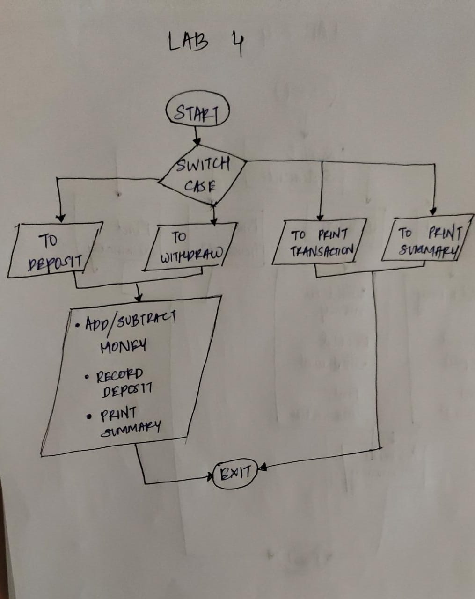

# Write a JAVA Menu driven program that does the following:
* You can ONLY have the below variables as global variables
    1. Account Number
    2. Account Holder Name
    3. Account Balance
* You MUST have the below as functions
    1. To initialize the customer
    2. To deposit money
    3. To withdraw money
    4. To print the transactions
    5. To print account summary
* Your menu will have the following operations once the customer is created
    1. To deposit money
    2. To withdraw money
    3. To print the transactionss
    4. To print account 
    
